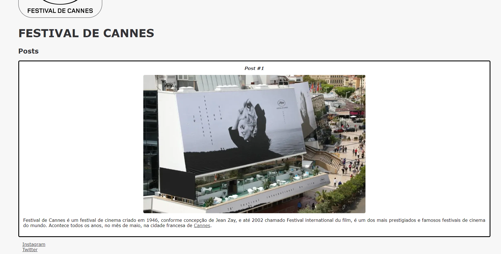

# Exercicio do curso "Introdução a Criação de Websites com HTML5 e CSS3"

## Exercicio
Foi proposto durante o curso para fazer um site simples usando as informações básicas que foi ensinado de HTML e CSS.

## Resultado
Fiz um site inicial para o Festival de Cannes que inclui vários topicos como:

- Estrutura básica do HTML
- Semântica do HTML como tags
- Estrutura do CSS
- Propriedades básicas do CSS como Box Model
- Personalização do codigo

O Resultado final foi esse: 

